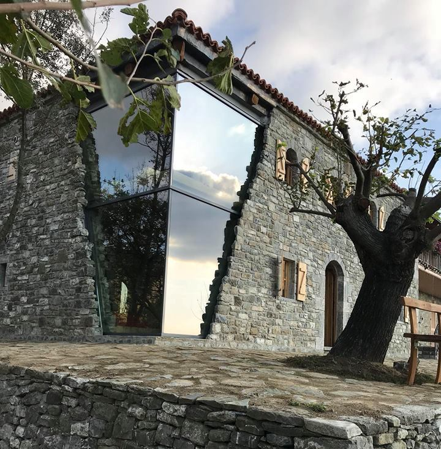
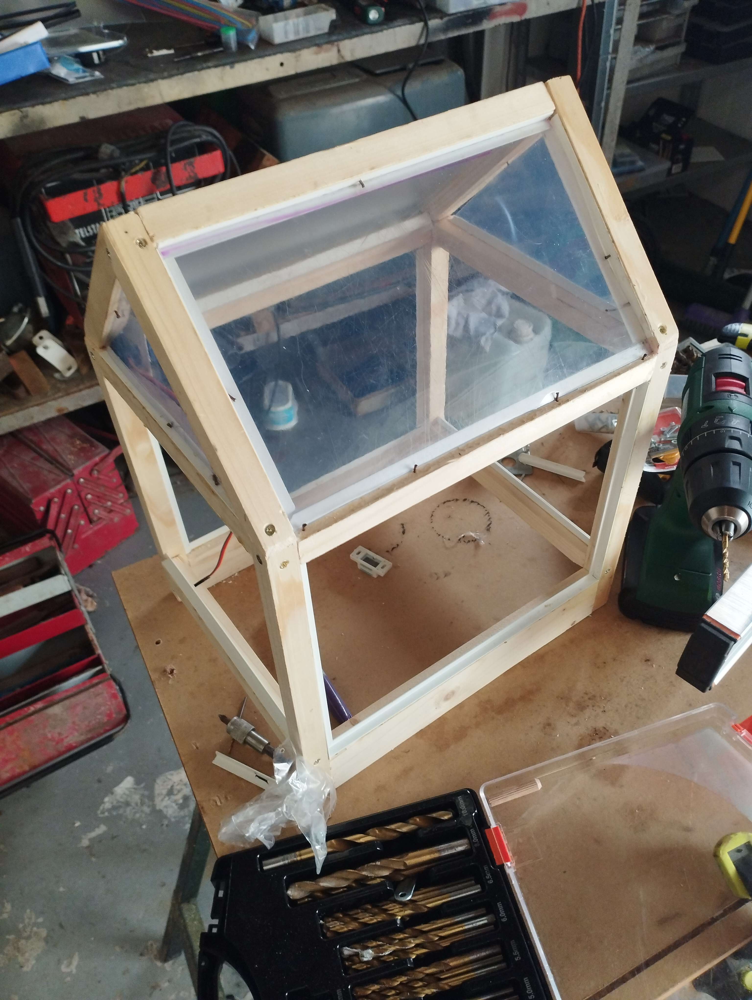
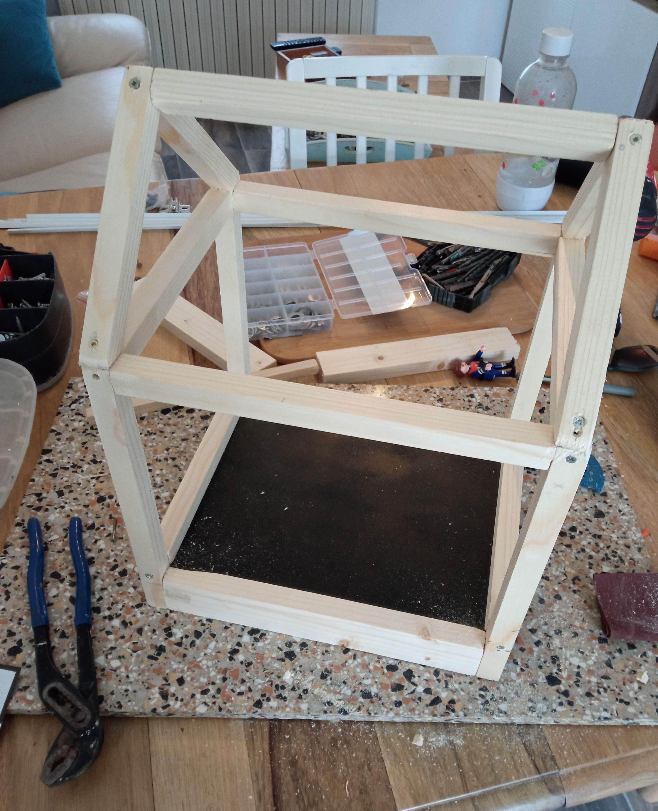
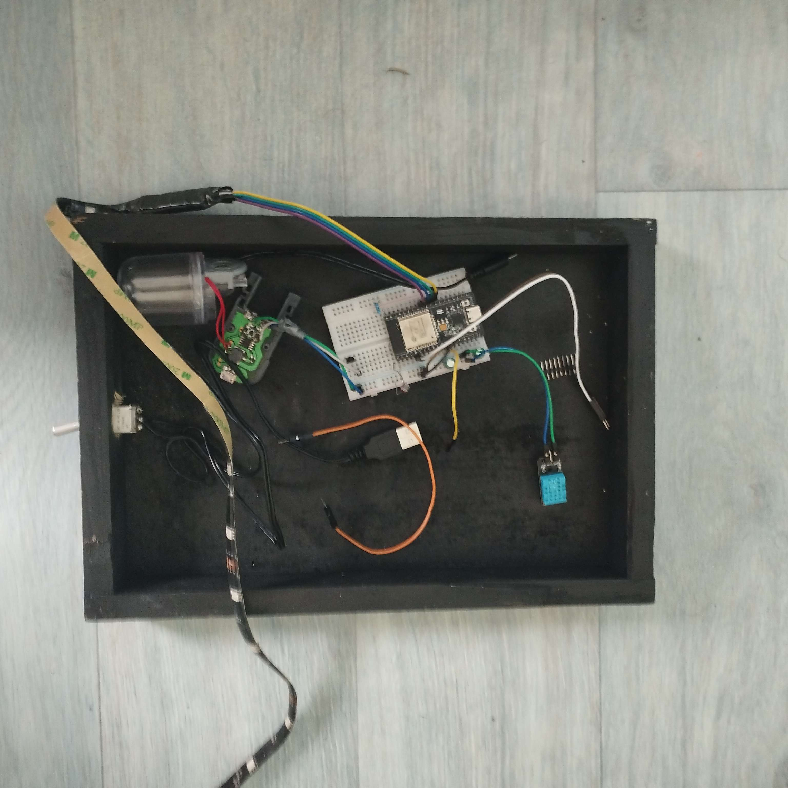

# Serre Connectée

Ce projet artistique présente une serre connectée, combinant art et technologie pour optimiser la croissance des plantes et sensibiliser à une agriculture urbaine durable.

## Sommaire 
- [Information](#information)
- [Inspiration](#inspiration)
- [La Construction](#la-construction)
- [Informatique / Programmation](#informatique--programmation)
- [Serre Finie](#serre-finie)
- [Conclusion](#conclusion)

## Information
Ce projet artistique présente une serre connectée, combinant art et technologie pour optimiser la croissance des plantes et sensibiliser à une agriculture urbaine durable.

## Inspiration
Nous nous sommes inspirés d'un bâtiment en ruine qui a été rénové par le studio Plis Atelier, rendant le bâtiment moderne et esthétique tout en préservant la structure de base.

    

## La Construction
Pour réaliser notre serre, nous avons utilisé du bois, du plastique transparent et des clous que nous avons cachés avec du mastic. Ensuite, nous l'avons peinte en blanc.

    
    

## Informatique / Programmation
La serre est accompagnée d'un système électronique entièrement contrôlable sur ce site via un panneau de contrôle. La serre offre des options telles que l'arrosage automatique, la ventilation avec un ventilateur, et une fenêtre ouvrable. Elle envoie également des informations sur l'humidité, la luminosité et la température. De plus, il est possible de choisir la couleur de la lumière à l'intérieur.

    
    

## Serre Finie
Voici quelques images de la serre une fois terminée.

    

## Conclusion
Ce projet de serre connectée montre comment l'intégration de l'art et de la technologie peut non seulement créer quelque chose de visuellement attrayant mais aussi fonctionnel. En combinant des techniques de construction traditionnelles avec des technologies modernes, nous avons réussi à développer une solution innovante pour l'agriculture urbaine durable. Nous espérons que ce projet inspirera d'autres à explorer les possibilités infinies qui se présentent lorsque différentes disciplines se rencontrent.
